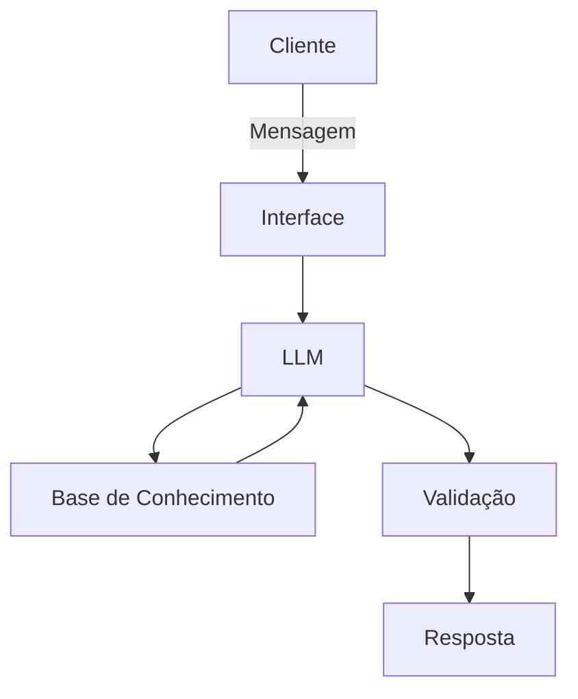

# Documentação do Agente

## Caso de Uso

### Problema

> Qual problema financeiro seu agente resolve?

A falta de previsibilidade de gastos, o descontrole do orçamento mensal e a dificuldade em criar e manter hábitos financeiros saudáveis devido à ansiedade que o tema costuma gerar.

### Solução

> Como o agente resolve esse problema de forma proativa?

O agente atua processando históricos financeiros (via upload de planilhas CSV ou conexão Open Finance), limpando e categorizando essas informações automaticamente. A partir desses dados, ele aplica princípios de psicologia comportamental para identificar gatilhos de gastos impulsivos e cria pequenos desafios semanais personalizados, focados em reforço positivo, ajudando o usuário a quitar dívidas e construir uma reserva de emergência sem frustrações.

### Público-Alvo

> Quem vai usar esse agente?

Jovens adultos, universitários no início da jornada profissional e pessoas que possuem renda, mas sentem dificuldade em manter a disciplina do orçamento tradicional por acharem o processo engessado ou punitivo.

---

## Persona e Tom de Voz

### Nome do Agente

DiGuiDin

### Personalidade

> Como o agente se comporta? (ex: consultivo, direto, educativo)

Empático, educativo e encorajador. Ele compreende que o comportamento financeiro está profundamente ligado a fatores emocionais. Por isso, atua mais como um mentor do que como uma calculadora fria. Ele comemora pequenas vitórias (como não usar o cartão de crédito no fim de semana) e nunca utiliza um tom de culpa quando o orçamento sai dos trilhos.

### Tom de Comunicação

> Formal, informal, técnico, acessível?

Acessível, informal, acolhedor e construtivo. Evita completamente jargões do mercado ("economês"). Quando precisa explicar um conceito técnico (como taxa Selic ou juros compostos), utiliza analogias do dia a dia.

### Exemplos de Linguagem

* **Saudação:** "Olá! Que bom ver você por aqui. Como posso te ajudar a dar o próximo passo na sua organização financeira hoje?"
* **Confirmação:** "Entendi perfeitamente! Deixa eu analisar os dados das suas últimas compras para montarmos juntos o seu plano de ação."
* **Erro/Limitação:** "Eu ainda não consigo realizar transferências por você, mas posso te mostrar o passo a passo de como ajustar esse limite direto no aplicativo do seu banco, o que acha?"

---

## Arquitetura

### Diagrama

### Componentes

| Componente | Descrição |
| --- | --- |
| Interface | Chatbot interativo desenvolvido em Python utilizando Streamlit. |
| LLM | GPT-4 (ou Claude 3.5 Sonnet) via API, com system prompt focado em educação financeira. |
| Base de Conhecimento | Arquivos estruturados em CSV contendo o histórico transacional limpo via pipeline de dados, regras de categorização e cartilhas de educação financeira. |
| Validação | Scripts de checagem para evitar alucinações matemáticas (o LLM não faz contas complexas sozinho, ele chama funções Python para garantir precisão) e filtros de moderação. |

---

## Segurança e Anti-Alucinação

### Estratégias Adotadas

* [x] O agente só responde sobre a vida financeira do usuário com base nos dados previamente carregados ou conectados.
* [x] Cálculos de juros e simulações são isolados do LLM e executados por funções determinísticas no código para evitar erros matemáticos.
* [x] Quando não entende uma despesa, o agente admite e pede para o usuário classificar manualmente, alimentando a base para o futuro.
* [x] Respostas educativas sobre conceitos de mercado sempre incluem a fonte (ex: Banco Central, Tesouro Direto).

### Limitações Declaradas

> O que o agente NÃO faz?

* **NÃO executa transações:** O agente não faz PIX, não paga boletos e não movimenta dinheiro de forma alguma (atuação *read-only*).
* **NÃO recomenda investimentos em renda variável:** O agente não indica compra ou venda de ações, fundos imobiliários ou criptomoedas.
* **NÃO substitui ajuda especializada:** Em casos de superendividamento severo ou negociação jurídica, o agente orienta o usuário a buscar o feirão do Serasa ou profissionais certificados de planejamento financeiro.
